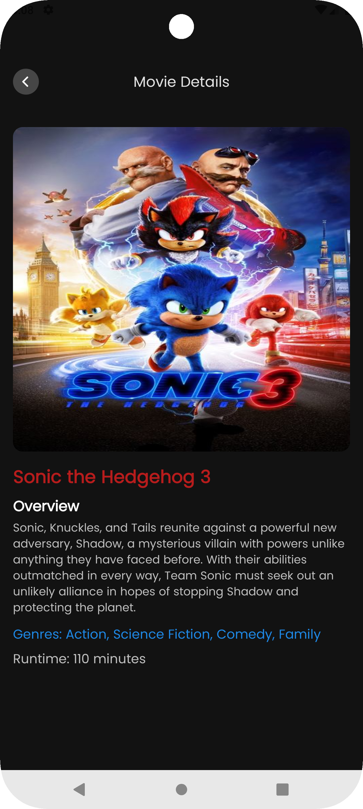

# 🎬 MovieApp - TMDB Movie Explorer

[](https://developer.android.com/)
[](https://kotlinlang.org/)
[](https://developer.android.com/jetpack/compose)
[](https://developer.android.com/training/dependency-injection/hilt-android)
[](https://developer.android.com/jetpack/guide)

## 📌 Overview
**MovieApp** is a modern Android application that displays movies and their details using **The Movie Database (TMDB) API**. The project follows **best practices** for Android development, leveraging:
- **MVVM Architecture**
- **Kotlin Coroutines & Flow** for asynchronous tasks
- **Retrofit** for API calls
- **Hilt (Dagger-Hilt)** for dependency injection
- **Jetpack Compose** for UI

---

## 🎥 Features
✅ Fetch and display **Now Playing** movies  
✅ Show detailed movie information  
✅ Search movies by title  
✅ Offline caching with **Room Database**  
✅ Dependency injection using **Hilt**  
✅ Modern **Jetpack Compose UI**

---

## 🛠 Tech Stack
| Component | Library |
|-----------|---------|
| UI | **Jetpack Compose** |
| Architecture | **MVVM (Model-View-ViewModel)** |
| API Client | **Retrofit 2 + Gson** |
| Dependency Injection | **Hilt (Dagger-Hilt)** |
| Async Handling | **Kotlin Coroutines + Flow** |
| Local Storage | **Room Database** |
| Navigation | **Jetpack Navigation Component** |
| Image Loading | **Coil** |

---

## 📸 Screenshots
| Movie List                          | Movie Details                             |
|-------------------------------------|-------------------------------------------|
|  |  |

---

## 🚀 Getting Started

### 🔑 Prerequisites
- Android Studio **Giraffe or newer**
- Kotlin **1.9+**
- **TMDB API Key** (Get one from [TMDB](https://www.themoviedb.org/))

### 🔧 Setup TMDB API Key
To run the project, add your TMDB API key in `local.properties`:

```properties
API_KEY=your_tmdb_api_key
ACCESS_TOKEN=your_tmdb_access_token
BASE_URL=https://api.themoviedb.org/3/
